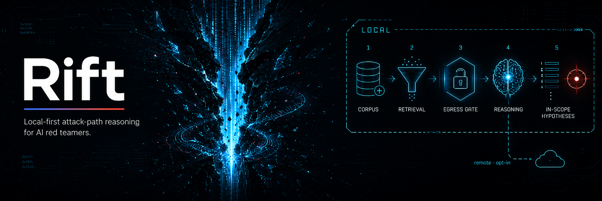
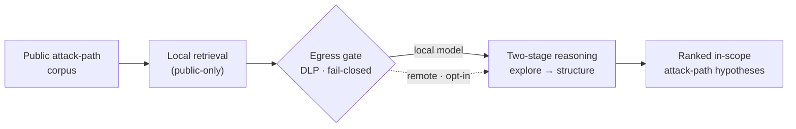

# Rift


**Rift helps you find realistic ways to attack an AI system — fast, and entirely on your own machine.**

If you're authorized to security-test an AI product — say, a coding assistant that can read files and run commands — the hardest part is the blank page: *where do I even start?* You describe the target, and Rift hands you a **ranked shortlist of specific, plausible attack approaches to try** — each one based on a real, already-published technique, not guesswork. You begin from concrete leads instead of nothing.

The attack ideas are drawn from published AI-security research — [MITRE ATLAS](https://atlas.mitre.org), [AgentDojo](https://github.com/ethz-spylab/agentdojo), and [InjecAgent](https://github.com/uiuc-kang-lab/InjecAgent) — so every suggestion traces back to a documented technique. Everything runs offline by default: nothing leaves your machine unless you explicitly send it, and a built-in filter strips secrets first.

---

## Start here

Install, pull the local models, build the index, and ask for attack paths:

```bash
pip install -r requirements.txt
ollama pull nomic-embed-text && ollama pull qwen2.5:3b && ollama pull qwen2.5-coder:14b
python rift/ingest.py                                          # build the local index
python rift/attack_path.py --target "coding-agent/default-permissions"
```

The egress gate prints the exact payload and asks you to confirm before anything is sent — that's the safety boundary, not a snag. Then a ranked, schema-validated attack path is written to `rift-corpus/generated/`, each route citing the real techniques it drew from — both as canonical JSON and as a human-readable Markdown report. **Want to see the output first?** [`examples/cases/example-attack-path/`](examples/cases/example-attack-path/attack-path.generated.md) is a complete rendered sample.

It runs in **research mode** by default — explore any generic product class, no setup. For an authorized engagement, see [Scope & modes](#scope-and-intent). To just see what retrieval pulls for a phrase: `python rift/query.py "trust boundary collapse for a coding agent" --k 5`.

## How it works



Retrieval is filtered to public-only material *before* the gate, so private context never enters a remote payload in the first place.

## What it does

- **Proposes attack paths, not just facts.** Describe a target surface (say, a coding agent with default permissions) and Rift suggests specific routes worth testing — each one grounded in a real technique from its corpus, not invented.
- **Knows the difference between *can* and *should*.** The core AI-security failure is an agent treating untrusted content as a trusted instruction. Rift classifies every route by which trust boundary it crosses and how likely it is to escalate.
- **Stays on your machine.** Embeddings and reasoning run through local models (via [Ollama](https://ollama.com)). No cloud, no logging out, no telemetry.
- **Has a hard safety boundary built in.** If you route a step to a remote model, the egress gate blocks the send unless the payload traces to public-only sources and is clear of blocked fields, keys, IPs, and paths — and it shows you the exact bytes first. It blocks; it never silently scrubs and sends.
- **Grounded by construction.** Every record is schema-validated and carries its source, and the model can only cite techniques that exist in the corpus — so it can't invent a citation. Unsupported or malformed fields are rejected.

## Why it's built the way it is

A few design choices that make Rift genuinely different from a typical "AI over your documents" tool:

- **Retrieval *is* the gate.** Most systems let the search step pull sensitive data freely and hope a filter catches it on the way out. Rift inverts that: before anything reaches a remote model, retrieval is filtered to public-only material — so private context simply never enters the payload in the first place.
- **Three independent safety layers.** The egress gate checks source sensitivity, blocked field names, *and* content patterns (keys, IPs, paths). All three must pass. One regex mistake isn't catastrophic, because two other layers still stand.
- **Two-stage reasoning.** One pass explores broadly for novel angles; a second pass structures the result against strict scoping rules and throws out anything that's actually expected behavior or out of scope — before a human ever sees it.
- **Almost no dependencies.** The core is pure Python and numpy — the vector index is just a `.npy` file and a `.json` file. No torch, no faiss, no langchain. You can read the whole thing in an afternoon and run it on any laptop.

## What's in the box

- **The engine** (`rift/`): index builder, retrieval + generation, two reasoning pipelines (entryway mapper and attack-path generator), the egress/DLP gate, per-role model routing, and schema validation.
- **A library of public attack patterns** (`rift-corpus/`): **16 schema-validated records** distilled from published AI-security research — [MITRE ATLAS](https://atlas.mitre.org), [AgentDojo](https://github.com/ethz-spylab/agentdojo), and [InjecAgent](https://github.com/uiuc-kang-lab/InjecAgent).
- **The reasoning prompts and JSON schemas** (`core/`) that define how routes are structured and what a valid record looks like.

## Models

Everything runs on local [Ollama](https://ollama.com) models by default — nothing is hardcoded to a vendor.

- **Generation** is fully swappable via environment variables, no code changes: `RIFT_MODEL`, `RIFT_REASON_MODEL`, and `RIFT_STRUCTURE_MODEL` each take a model name, and the matching `*_BASE_URL` / `*_KEY_FILE` vars point a role at any endpoint speaking the standard chat-completions API (Ollama, vLLM, LM Studio, OpenRouter, Azure, …), local or remote. `rift/attack_path.py` also exposes `--reason-model` / `--structure-model` flags.
- **Embeddings** default to `nomic-embed-text`. To use a different embedder, edit `rift/rift_rag/embed.py`: change `EMBED_MODEL`, set `EMBED_DIM` to your model's vector size, and adjust the `search_document:` / `search_query:` prefixes (those are specific to nomic's asymmetric retrieval).

**One key, any model.** The simplest way to reach frontier models is a gateway — point a role at [OpenRouter](https://openrouter.ai) (one key reaches GPT, Gemini, Llama, and more) or a self-hosted LiteLLM proxy. Run the exploration pass on a frontier model while structuring stays local and the egress gate stays armed:

```bash
printf '%s' "<your-openrouter-key>" > ~/.rift-key
export RIFT_REASON_KEY_FILE=~/.rift-key
export RIFT_REASON_BASE_URL=https://openrouter.ai/api/v1
export RIFT_REASON_MODEL="<provider/model>"   # any model your key can reach
python rift/attack_path.py --target "coding-agent/default-permissions"
```

Going direct (no gateway) works for any provider that exposes a **chat-completions** endpoint — OpenAI, DeepSeek, Groq, Azure, a local server, etc.: point the `RIFT_*` vars at its base URL and its own key, no adapter needed. Providers whose only native API is a *different* format need a gateway to translate — which is exactly why Rift bundles no per-provider SDKs (they'd bloat the stdlib-only core); the gateway does that, outside the engine. Either way, the egress gate runs before every remote call.

The two-stage pipeline is verified end-to-end with both a local model (via Ollama) and a remote frontier reasoning model.

## Scope and intent

Rift is a tool for **authorized** adversarial assessment of AI products. Its corpus models attack technique *families* that are already publicly disclosed; the engine recombines them to suggest in-scope routes a researcher then verifies by hand. It outputs **hypotheses, not verdicts** — it doesn't define your scope, run the attacks, or replace threat modeling. It ships with no live target configuration and no engagement data.

**Modes.** By default Rift runs in `research` mode: it explores a generic product class (e.g. `coding-agent/default-permissions`) and **refuses concrete or named targets** — you cannot point it at a hostname or company. (`--mode bounty` adds an authorized-scope allowlist for real, authorized engagements.) If you route a reasoning step to a *remote* API, the egress gate shows you the exact bytes and waits for confirmation — set `RIFT_ALLOW_LOCAL_AUTOCONFIRM=1` only for trusted local runs.

## Using Rift on a bug-bounty program

Bounty work has the same blank-page problem as a red-team engagement, plus a sharper cost: every route you chase that turns out to be expected behavior or out-of-bounds is a wasted submission cycle. `--mode bounty` is built for exactly that.

In bounty mode, retrieval is constrained to corpus precedents tagged `scope_tag: in_scope` — techniques that represent a legitimate vulnerability class, not expected behavior — and, when you also pass `--trust-boundary`, further narrowed to records matching the `target_surface` you declared. So the routes it hands you are grounded in real, in-scope precedent and aimed at the surface you're testing, instead of a pile of plausible-but-unsubmittable ideas. Every artifact also carries an `authorization_ref`, so a route generated for an authorized engagement can never be confused with an internal-research hypothesis.

What this does **not** do — and the distinction matters:

> **Rift filters to what you authorize; it does not read or certify any program's scope.** "In scope" inside Rift means *grounded in a legitimate-finding precedent* — it is **not** a check against a specific program's asset list. You still confirm a target is on the program's authorized scope before you touch it and before you submit. Rift narrows the search to your declared surface; the legal boundary is yours to own.

Used that way, bounty mode is a focus tool: fewer dead-end routes, every suggestion traceable to a published technique, and a built-in egress gate so nothing about your engagement leaks if you route a pass to a remote model.

## Adding your own records

Every record carries a `sensitivity` tag, and it's the basis of the egress gate's first layer:

- **`local_only` (the default)** — never sent to a remote model. **An untagged record is treated as `local_only`**, so anything you forget to tag simply can't leak.
- **`public`** — eligible to leave for a remote model. A record becomes `public` only by your deliberate review — after you've checked it for secrets, hosts, and unreported detail. Nothing auto-promotes it.

**Easiest:** run `python rift/new_record.py` — it prompts only for the fields that need a human (enums shown as numbered menus), fills the boilerplate with safe defaults, validates against the schema, and writes the file. Pass the fields as flags for a one-liner; `--help` lists every choice.

To add one by hand instead: drop a schema-valid JSON record into `rift-corpus/attack-paths/`, set its `sensitivity` once you've reviewed it, and re-run `python rift/ingest.py`. If you leave it `local_only`, the engine still uses it for *local* reasoning, but the egress gate refuses to send it to any remote API — by design, not by accident.

`ingest.py` indexes any `*.json` / `*.md` under `rift-corpus/attack-paths/`. Each record must validate against [`core/schemas/attack_path_record.schema.json`](core/schemas/attack_path_record.schema.json) — the rules that trip people up: `target_surface` must be a generic `<product-class>/<mode>` (never a real host or company), `description` is ≥100 chars, `failure_class` needs at least one entry, `sensitivity` defaults to `local_only`, and `verified` stays `false` until you've reviewed it. A minimal valid record:

```json
{
  "record_id": "manual:my-technique-001",
  "source": "manual",
  "schema_version": "1.0",
  "ingest_date": "2026-01-01T00:00:00Z",
  "title": "One-line name for the technique",
  "description": "At least 100 characters: what untrusted content becomes a trusted instruction, what the agent then does, and why that's a trust-boundary collapse rather than expected behavior.",
  "failure_class": ["workspace-content-to-instruction-injection"],
  "target_surface": "coding-agent/default-permissions",
  "trust_boundary": "workspace-content-to-instruction",
  "kill_chain_stage": "consequential-action",
  "severity": "high",
  "human_in_loop": false,
  "user_actions_in_attack_chain": [],
  "precondition_weight": "light",
  "permission_mode": "default",
  "consequential_action": "config-write",
  "harm_layer": "durable-side-effect",
  "scope_tag": "unknown",
  "sensitivity": "local_only",
  "domain": "ai_native",
  "verified": false,
  "use_for_rag": true,
  "raw_ref": "your-source-url-or-citation"
}
```

See [`rift-corpus/SOURCES.md`](rift-corpus/SOURCES.md) for how the shipped records cite their public sources.

**Working in this repo?** Enable the commit guard once — `git config core.hooksPath hooks` — and git will refuse to commit any record that isn't `sensitivity: "public"`. It's the git-layer counterpart to the egress gate: a private finding can't slip into the public repo through an accidental `git add`.

---

## Take it to the next level

Rift is published as a clean base — a working engine and a starter corpus — meant to be forked and pushed further. Real extension points, with the hooks already in the code:

- **Plug in stronger reasoning per role.** `rift/provider.py` already routes three roles (default / explore / structure) to independent providers. Point the exploration pass at a frontier model while structuring stays on a small trusted local model — no code changes, just env vars.
- **Grow the corpus.** The 16 records show the pattern: pull from a public attack taxonomy, normalize to the schema, tag source and sensitivity. Automate ingestion of new datasets, or cross-reference CVE/CWE catalogs.
- **Add a research mode.** The architecture supports relaxing the scope filter for internal red-teaming over the full reference corpus while keeping the egress gate armed — a path to measuring route quality without scope-annotation overhead.
- **Weight retrieval by confidence tier.** Retrieval already filters on domain, failure class, scope, and kill-chain stage. Add weighting (e.g. confirmed-on-production vs contested-on-proxy) to sharpen target selection.
- **Close the loop with auto-grading.** Build a judge that scores generated routes for over-claiming, scope drift, or leakage — turning Rift from a one-shot proposer into a self-improving system.
- **Visualize the safety boundary.** The engine logs every egress decision (with payload hashes) and tracks rate limits. A small dashboard over those logs would surface usage patterns and every DLP block.

If you build something on top of this, open an issue or PR — I'd like to see where it goes.

## License

MIT — see [LICENSE](LICENSE).
